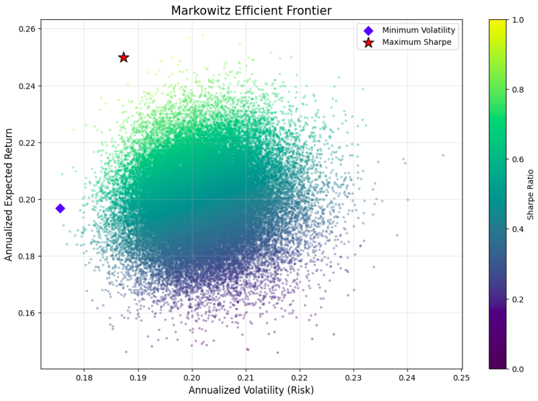

# Markowitz Efficient Frontier for 15 Indian Blue-Chip Stocks

## Project Description
This project implements the **Markowitz Efficient Frontier** using historical data for 15 major Indian blue-chip stocks. Through a **Monte Carlo simulation of 50,000 unique iterations**, the project identifies the mathematically "optimal" asset allocation to maximize the Sharpe ratio.

## Features
* **Data:** 5 years of historical adjusted closing prices from yfinance.
* **Monte Carlo Simulation:** Ran 50,000 random weight combinations to map the "Feasible Set" of portfolios.
* Identified the **Maximum Sharpe Ratio Portfolio** and the **Minimum Volatility Portfolio**.

## Asset Selection
**15 high-weightage stocks from the Nifty 50 index** were chosed to represent a diversified cross-section of the Indian economy. The selection includes leaders in Banking (ICICI, HDFC, SBI), IT (TCS, Infosys), Industrials (L&T), and FMCG (ITC, HUL) to ensure a robust covariance matrix for the optimization model.

## Frontier Plot

## Maximum Sharpe Portfolio
* **Sharpe Ratio:** 0.96
* **Expected Annual Return:** 24.99%
* **Expected Volatility:** 18.73%
* **Final Value:** Rs.3062919.12
* **ROI:** 206.29%

*Disclaimer: This project and related analysis are purely for educational purposes*
